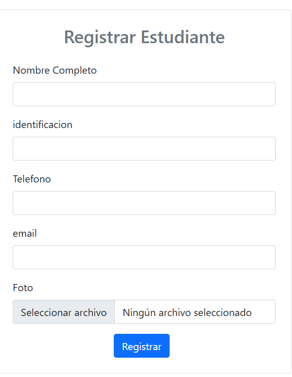
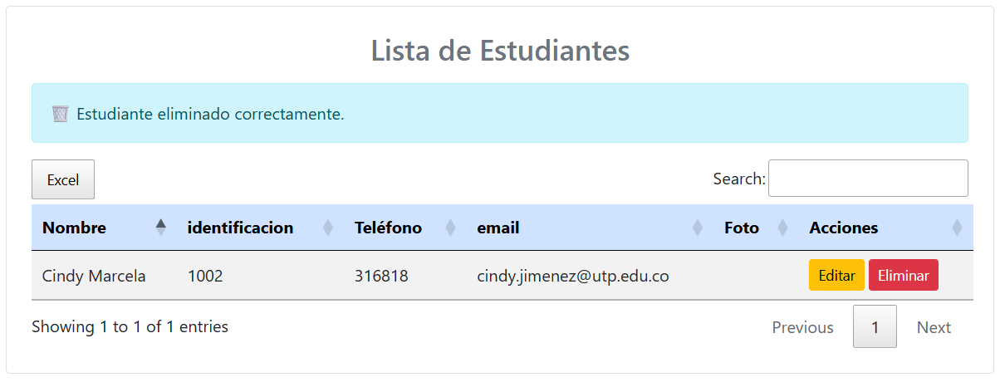
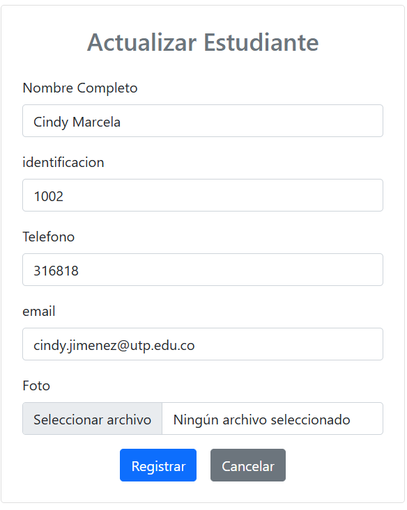

# 🎓 Sistema CRUD de Estudiantes

Aplicación web **CRUD de estudiantes** desarrollada con **PHP, MySQL, jQuery, AJAX y Bootstrap 5**.  
Incluye gestión de fotos de perfil, validaciones y una tabla interactiva con **DataTables**.

---

## ✨ Características
- ✅ Crear, leer, actualizar y eliminar estudiantes (CRUD completo).  
- 📸 Carga de imagen de perfil con almacenamiento en servidor.  
- 🔐 Validación de identificación y correo electrónico únicos.  
- 🔍 Tabla interactiva con DataTables: búsqueda, ordenamiento, paginación y exportación a **Excel**.  
- 🔗 Extensible para relación N:N con cursos.  

---

## 🚀 Instalación

1. **Clonar repositorio**
   ```bash
   git clone https://github.com/tuusuario/tecnolab-crud-estudiantes.git
   cd tecnolab-crud-estudiantes

## Base de datos

### 1. **Base de datos**
* Importa `sql/database.sql` en tu servidor MySQL.
* Esto creará la tabla `students`.

### 2. **Configurar conexión**
* Edita el archivo `db/connection.php` y ajusta tus credenciales:

```php
$conexion = new mysqli("localhost", "usuario", "password", "tecnolab");
```

### 3. **Levantar servidor**
* Usar **XAMPP / WAMP / Laragon** o servidor Apache/Nginx.
* Accede a:

```
http://localhost/CRUD-PHP/index.php
```

## 🛠️ Requisitos
* PHP **7.4+**
* MySQL **5.7+**
* Apache o Nginx

## 📂 Estructura del proyecto

```
tecnolab-crud-estudiantes/
│── assets/
│   ├── img/estudiantes/   # Fotos de estudiantes
│   └── js/main.js         # Lógica AJAX con jQuery
│
│── controllers/
│   └── studentControllers.php  # CRUD backend
│
│── db/
│   └── connection.php          # Conexión MySQL
│
│── index.php                   # UI principal
│── sql/init.sql                # Script de BD
│── README.md                   # Documentación
```

## 📸 Capturas
🔹 **Formulario + Tabla con DataTables** *(inserta screenshots aquí)*






## 👩‍💻 Uso rápido
1. Rellena el formulario con los datos del estudiante.
2. Haz clic en **Registrar**.
3. Verás al estudiante aparecer en la tabla.
4. Con los botones de **Editar** y **Eliminar** puedes gestionar los registros.

## Endpoints
## 🔧 API Endpoints
- `GET /controllers/studentControllers.php?action=read` → Lista todos los estudiantes (JSON).
- `POST /controllers/studentControllers.php?action=create` → Crea un estudiante.
- `POST /controllers/studentControllers.php?action=update` → Actualiza un estudiante.
- `POST /controllers/studentControllers.php?action=delete` → Elimina un estudiante.
- `GET /controllers/studentControllers.php?action=get&id=ID` → Obtiene datos de un estudiante.

## 🙌 Contribución
1. Haz un fork del proyecto.
2. Crea tu rama (`git checkout -b feature/nueva-funcionalidad`).
3. Haz commit de tus cambios (`git commit -m 'Agregada nueva funcionalidad'`).
4. Haz push (`git push origin feature/nueva-funcionalidad`).
5. Abre un Pull Request.

## ✨ Créditos
Proyecto desarrollado por **Cindy ** 💻